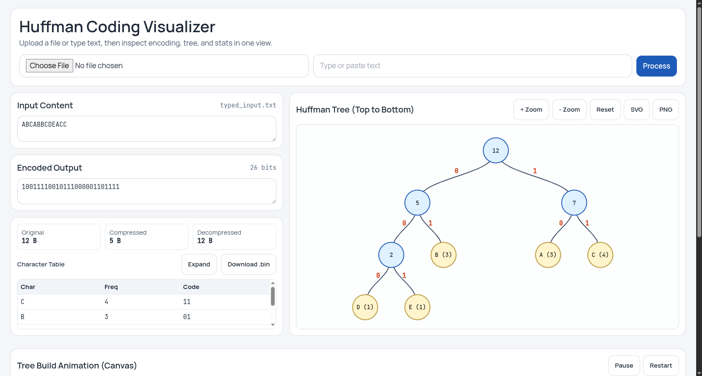
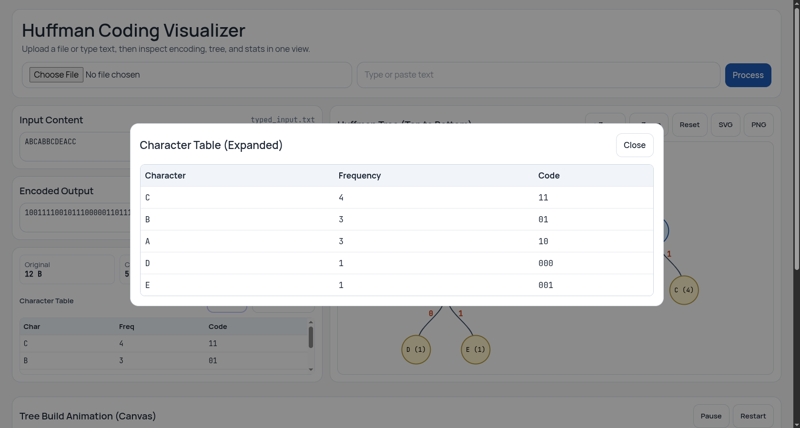

# Huffman Coding Visualizer — Detailed Documentation

This document explains the design, implementation, and usage of the Huffman Coding Visualizer project in detail. It covers the architecture, algorithm, UI choices, files, and how the build/merge animation is produced.

If you want a short quickstart, see the top-level `README.md`. This document goes deeper into "why" and "how".

## Table of contents
- Overview
- Architecture
- Huffman algorithm (implementation details)
- Merge-step tracking (animation data)
- UI and visualization design choices
- Files and module structure
- How to run (development)
- Screenshots
- Limitations and future work
- Contributing

---

## Overview

This repository implements a small web application (Flask) that lets you compress text using Huffman coding and visualize the resulting tree. The project provides:

- A simple Flask backend (`app.py`) that accepts a file upload or raw typed text, runs the Huffman algorithm, writes a compressed `.bin` file, and decompresses it to verify correctness.
- A compact single-file frontend (`templates/index.html`) using Tailwind CSS for layout, D3.js for the scalable tree diagram (SVG), and an HTML5 canvas for a bottom-up build animation that visualizes the merges performed by the algorithm.
- Merge tracing inside the Huffman implementation so the visualization can replay the merge order (the same order used to build the final tree).

The goal is educational: show how Huffman coding merges low-frequency nodes first and how the code map emerges.

## Architecture

- Backend: Flask app with a single main route `/` for upload and processing and `/download/<filename>` for serving the compressed file.
- Algorithm module: `HuffmanCoding.py` encapsulates frequency counting, heap operations, code generation, padding, byte conversion, compression and decompression. It also records merge steps for animation.
- Frontend: `templates/index.html` — includes UI controls, encoded preview, stats, D3 tree SVG, canvas animation, and export controls.

The application is intentionally minimal: the Flask server runs the algorithm synchronously and returns a rendered template. This keeps the project small and easy to run locally.

## Huffman algorithm (implementation details)

Key implementation notes:

- Frequency calculation: character frequencies are computed by iterating the input text and building a frequency dictionary.
- Min-heap: Python's `heapq` is used to maintain the smallest-frequency nodes.
- Node structure: each heap node stores `char` (or `None` for internal nodes), `freq`, left/right children and an internal `node_id`. A `__lt__` comparator makes nodes comparable by frequency for the heap.
- Merge order recording: every time two nodes are popped and merged into a parent node, we record a step object `{ left, right, parent }` (each with id, char, freq, is_leaf). These steps are used by the canvas animation to replay the exact merges performed by the algorithm.
- Code generation: after building the tree, a recursive traversal assigns binary codes, using `0` for left and `1` for right. A single-character input is handled by assigning the code `0` rather than an empty string.
- Padding & bytes: encoded bitstring is padded to a multiple of 8 with padding length stored in the first byte. The padded string is converted to bytes and written to `.bin`.

## Merge-step tracking (how the animation data is built)

Inside `HuffmanCoding.compress()` the algorithm resets a `merge_steps` list and a node id counter. During the merge loop each merge appends a step with the left, right and parent nodes' metadata.

The backend converts these steps into a JSON-friendly array that the frontend receives in the template context as `merge_steps`. Each step looks like:

```json
{
  "left": { "id": 1, "char": "a", "freq": 2, "is_leaf": true },
  "right": { "id": 2, "char": "b", "freq": 3, "is_leaf": true },
  "parent": { "id": 5, "char": null, "freq": 5, "is_leaf": false }
}
```

The canvas animation uses these ordered merge steps to draw leaves first, then animate each merge by connecting the two nodes into a newly created parent node (bottom-up). This mirrors the real algorithmic behaviour and makes the visualization educational and faithful.

## UI and visualization design decisions

- Tailwind CSS (via CDN): lightweight utility-first styling that allowed fast iteration and a clean look.
- D3.js (SVG): used for the static interactive tree diagram — it provides convenient `d3.hierarchy()` and `d3.tree()` layouts, easy link generation (`linkVertical()`), and zoom/pan behaviour.
- Canvas (animation): chosen for the merge animation because incremental drawing and per-frame control are simpler and more performant with canvas than manipulating many SVG elements during animation frames. The canvas draws leaves first, then animates lines and parent node appearances per merge step.
- Exports: the main tree is vector (SVG). Exporting PNG is done by serializing a styled SVG and drawing it on a canvas to produce a raster image.

Why this split (SVG + Canvas)?

- SVG (D3) is best for the static, interactive final tree (supports zoom, pan, accessibility). Canvas is better for dense frame-by-frame animation of a build process — it gives full control over drawing order and simplifies per-frame clearing/redraw.

## Files and module structure

- `app.py` — Flask server, request handling, template rendering, and helper for converting merge steps to JSON-friendly objects.
- `HuffmanCoding.py` — Huffman implementation and merge-step recording.
- `templates/index.html` — all frontend HTML/CSS/JS in one file (Tailwind, D3, animation canvas). The file expects `tree_data` and `merge_steps` objects in the template context.
- `uploads/` — runtime directory where uploaded and typed-text temporary files are stored (excluded by `.gitignore`).
- `docs/` — this directory (documentation). Place screenshots into `docs/screenshots/` and name them `SS1.png` and `SS2.png` so they appear in the documentation.

## How to run (development)

Minimum steps:

1. Create a Python 3 virtualenv and activate it:

   - python -m venv .venv
   - source .venv/bin/activate   # macOS / Linux
   - .venv\Scripts\activate    # Windows (PowerShell)

2. Install Flask (this project uses only Flask as a dependency):

   - pip install flask

3. Run the server:

   - python app.py

4. Open your browser to `http://127.0.0.1:5000`.

Notes:

- The server writes temporary files into `uploads/`. Those files are ignored by `.gitignore`.
- The app runs synchronously (single-threaded dev server) — it's fine for local testing and learning.

## Screenshots




